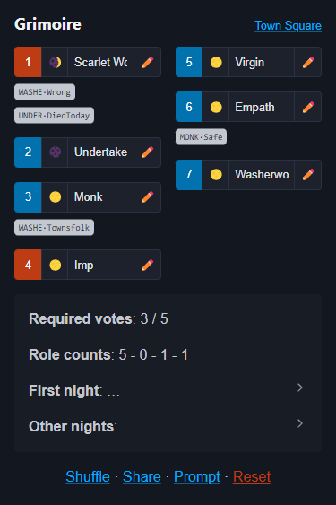
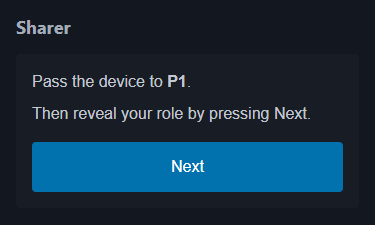
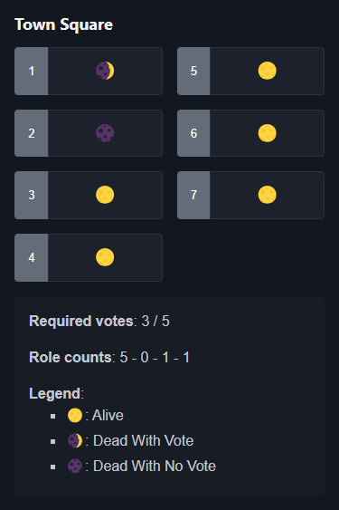
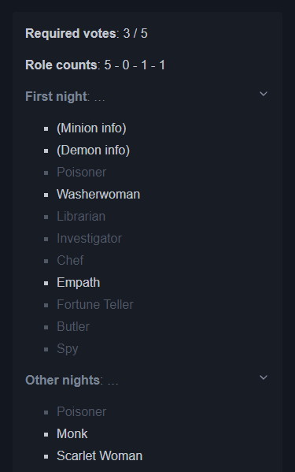
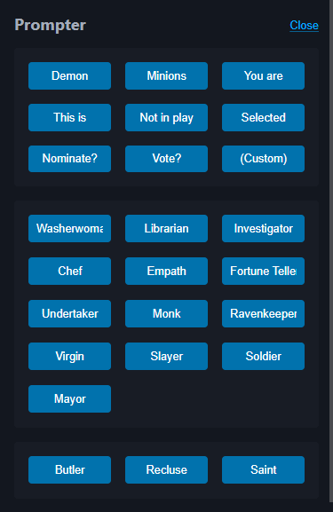

<!-- ghmd tutorial.md --embed-css --dark -->

# Pocket Grimoire Tutorial

[Blood on the Clocktower](https://bloodontheclocktower.com/) (BOTC) is a game of murder, mystery, deduction, and deception. It's a social game with unique good and evil roles, similar to Werewolf or Mafia. The good team wins if they can execute the demon, while the evil team wins if they can wipe out the village.

Using [Pocket Grimoire](https://botc.kvn.ovh), you can play BOTC _without_ physical components (having role sheets is still recommended). The Storyteller (ST) will use one device as the Grimoire (dashboard), while the players can utilize another device to display the town square.

This tutorial is **targeted to the ST** who wants to use this app to play BOTC.

## Setting Up

### Players and Editions

Upon opening the app, you will be prompted the **number of players** and **the edition** of the game. Currently, the app supports 5–15 players (travellers are not supported) and 4 editions:

1. [Trouble Brewing](https://botc.kvn.ovh/files/tb.pdf)
2. [Bad Moon Rising](https://botc.kvn.ovh/files/bmr.pdf)
3. [Sects & Violet](https://botc.kvn.ovh/files/sv.pdf)
4. [No Greater Joy](https://botc.kvn.ovh/files/ngj.pdf) (custom [Teensyville](https://wiki.bloodontheclocktower.com/Teensyville) game for 5–6 players)

The app will then generate a list of players numbered 1–N. You must **associate these numbers** to the players. Optionally, you can click on each number to **assign an initial**.

### Role Selection

The app preselects _random_ roles to **fulfill the required role counts**, without considering modifiers, balance, etc. You can use it as a baseline, and adjust it to your preference. Note that the requirement is also displayed on the bottom:

> **Role counts**: [Townsfolk] - [Outsider] - [Minion] - [Demon]

After selecting the roles, you should click the **"Shuffle"** button (once for fairness) on the bottom to shuffle the roles to the players. Then, click the **"Share"** button to secretly share the roles with the players, in sequence.

### Town Square

If you click the **"Town Square"** button at the top-right corner, a link will be copied to your clipboard. You can **share this link** with the players, so they can access the town square. The town square will display the players' status _in sync_ with the Grimoire, plus some other useful information.

Optionally, you can skip it and use physical tokens to display players' status.

## Running the Game

### Status

To change players' status, click the status dropdown (showing _moon_ emoji). This will be reflected immediately on the town square.

### Markers

To add or remove markers, click the marker dropdown (showing _pencil_ emoji). Selecting a non-existing marker will add it, while selecting an existing one will remove it.

Note that most markers (except "Good" and "Evil") are considered unique, so marking a player with it will remove the same marker from another player, if any.

### Night Order

Night order for abilities (both first and other nights) can be viewed in an accordion on the bottom. Roles not in game are greyed out, but shown for storytelling purposes.

### Prompts

To replace cardboard prompts during the nights (e.g., "This is the Demon"), click the **"Prompt"** button on the bottom. You will be presented with a list of available prompts, as well as an option to create a custom one.

Role prompts below can be used to share not-in-play roles to the Demon, information for Washerwoman, etc.

## Ending the Game

When you wish to end the game, click the **"Reset"** button on the bottom. This will reset the data so you can start a new game.
